# ETL

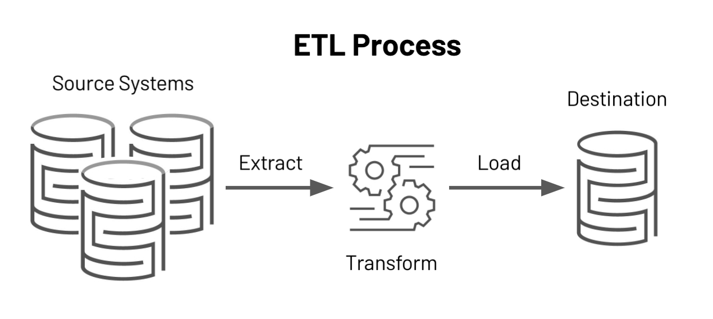

### 1. Базовые концепции

**ETL** (Extract Transform Load) - это извлечение, преобразование и загрузка. ETL является
традиционно принятым для организаций способом объединения данных из нескольких систем в единую базу данных, хранилище
данных(DWH) или озеро данных(data lake). ETL можно использовать для хранения устаревших данных или, что более
характерно сегодня, для агрегирования данных и последующего их анализа и принятия бизнес-решений.

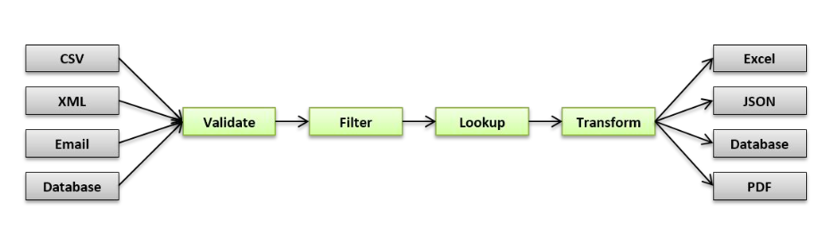

Как это было раньше?

- кастомные скрипты/процедуры/вьюхи
- ручной деплой
- **cron** для регулярного запуска задач

Какие были проблемы?

- задачи растут как снежный ком
- зависимости между задачами
- отсутствие мониторинга
- отсутствие механизма повторного запуска
- fault tolerance (отказоустойчивость)


### 2. Обзор решений[^2]


### 3. Apache Airflow[^3]

**Airflow** – это платформа для создания, мониторинга и оркестрации пайплайнов.


Этот open source проект, написанный на Python, был создан в 2014 году в компании Airbnb. В 2016 году Airflow ушел под
Apache Software Foundation, прошел через инкубатор и в начале 2019 года перешел в статус top-level проекта Apache.
Open-source.

В мире обработки данных некоторые называют его ETL-инструментом, но это не совсем ETL в классическом его понимании, как,
например, Pentaho, Informatica PowerCenter, Talend и иже с ними.

Airflow – это оркестратор, “cron на батарейках”: он сам **НЕ** выполняет тяжелую работу по перекладке и обработке
данных, а говорит другим системам и фреймворкам, что и в какое время надо делать, и следит за статусом выполнения.

#### 3.1 Основные сущности

- Направленные ациклические графы (DAG`s)
- Задачи (Tasks)
- Операторы (Operators)
- Сенсоры (Sensor)
- Хуки (Hooks)

#### 3.1 DAG

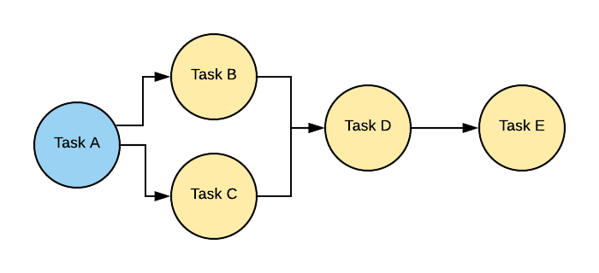

**DAG** — или направленный ациклический граф (Directed Acyclic Graph) — это набор всех задач, которые вы хотите
запустить, организованный таким образом, чтобы отражать их отношения и зависимости.

**DAG** — файл конфигурации, описывающий набор задач, которые необходимо выполнить в строго определенной
последовательности по определенному расписанию. Он задается функцией или декоратором. Разработчик, проектируя DAG,
закладывает набор операторов, на которых будут построены задачи внутри DAG’а.

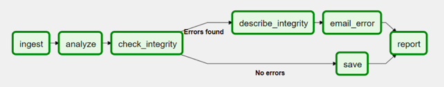

На уровне объекта DAG задаются настройки, например:

- Время начала выполнения пайплайна (`start_date`)
- Периодичность запуска (`schedule_interval`)
- Информация о владельце DAG (`owner`)
- Количество повторений в случае неудач (`retries`)
- Пауза между повторами (`retry_delay`)

Пример описания DAG`а на Python:

```python
import datetime
import pendulum

import requests
from airflow.decorators import dag, task
from airflow.providers.postgres.hooks.postgres import PostgresHook


@dag(
    schedule_interval="0 0 * * *",
    start_date=pendulum.datetime(2021, 1, 1, tz="UTC"),
    catchup=False,
    dagrun_timeout=datetime.timedelta(minutes=60),
    default_args=dict(retries=3, retry_delay=timedelta(minutes=5)),
)
def etl():
    @task
    def get_data():
        data_path = "/opt/airflow/dags/files/employees.csv"

        url = "https://raw.githubusercontent.com/apache/airflow/main/docs/apache-airflow/pipeline_example.csv"

        response = requests.request("GET", url)

        with open(data_path, "w") as file:
            file.write(response.text)

        postgres_hook = PostgresHook(postgres_conn_id="postgres_default")
        conn = postgres_hook.get_conn()
        cur = conn.cursor()
        with open(data_path, "r") as file:
            cur.copy_expert(
                "COPY EMPLOYEES_TEMP FROM STDIN WITH CSV HEADER DELIMITER AS ',' QUOTE '\"'",
                file,
            )
        conn.commit()

    @task
    def merge_data():
        query = """
                DELETE FROM EMPLOYEES e
                USING EMPLOYEES_TEMP et
                WHERE e."Serial Number" = et."Serial Number";

                INSERT INTO EMPLOYEES
                SELECT *
                FROM EMPLOYEES_TEMP;
                """
        try:
            postgres_hook = PostgresHook(postgres_conn_id="postgres_default")
            conn = postgres_hook.get_conn()
            cur = conn.cursor()
            cur.execute(query)
            conn.commit()
            return 0
        except Exception as e:
            return 1
    
    get_data() >> merge_data()


dag = etl()
```


```py
import datetime
import pendulum

from airflow.decorators import dag, task


@dag(
    schedule_interval="0 0 * * *",
    start_date=pendulum.datetime(2021, 1, 1, tz="UTC"),
    catchup=False,
    dagrun_timeout=datetime.timedelta(minutes=60),
    default_args=dict(retries=3, retry_delay=timedelta(minutes=5)),
)
def etl():
    @task
    def task_a():
        ...
    
    @task
    def task_b():
        ...
    
    @task
    def task_c():
        ...
    
    @task
    def task_d():
        ...
    
    @task
    def task_e():
        ...
    
    task_a() >> task_b()
    task_a() >> task_c()
    task_b() >> task_d()
    task_c() >> task_d()
    task_d() >> task_e()

dag = etl()
```

Пример сложного DAG`а:

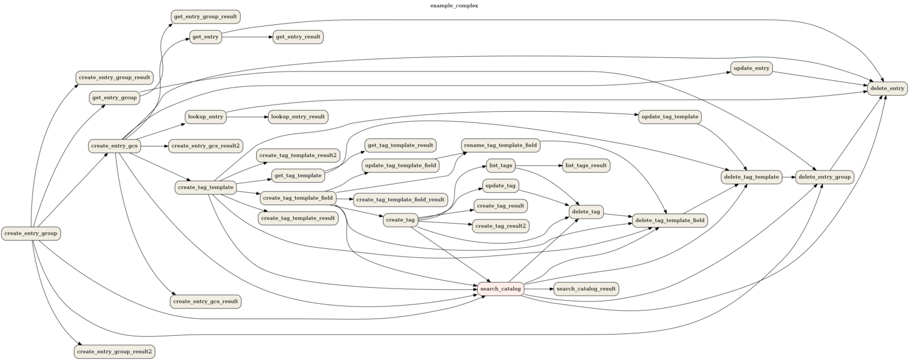

#### 3.2 Task

**Task** (задача) — со стороны Airflow все задачи делятся на пулы. Пулы создаются вручную. Как правило, их цель —
ограничить нагрузку на работу с источником или типизировать задачи внутри DWH. Пул, заданный на уровне DAG-а, можно
переопределить на уровне задачи.

Прежде чем попасть на исполнение, задача проходит следующие этапы:

- В DAG-е выполнены все предыдущие задачи, так что можно поставить новую на очередь
- Очередь сортируется в зависимости от приоритета задач (приоритетами тоже можно управлять), и, если в пуле есть
  свободный слот, задачу можно взять в работу
- Если есть свободный worker celery, задача направляется в него

Такими этапами управляет планировщик и о нём мы поговорим чуть позже.

Пример описания task`ов на Python:

```python
t1 = BashOperator(
    task_id='print_date',
    bash_command='date',
)

t2 = BashOperator(
    task_id='sleep',
    depends_on_past=False,
    bash_command='sleep 5',
    retries=3,
)
```

Различные состояния task`а в Airflow:

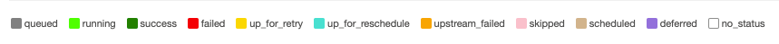

#### 3.3 Operator

**Оператор** - это сущность, на основании которой создаются экземпляры заданий, где описывается, что будет происходить
во время исполнения каждого экземпляра задания. Иными словами, это шаблон для предопределенной задачи, которая
декларативно задается внутри DAG`а.

- **PythonOperator** — оператор для исполнения python кода
- **BashOperator** — запуск bash скриптов/команд
- **PostgresOperator** — вызов SQL запросов в PostgreSQL БД
- **RedshiftToS3Transfer** — запуск UNLOAD команды из Redshift в S3
- **EmailOperator** — отправка электронных писем
- **HTTPOperator** — работа с http-запросами

> **Важно!**
>
> Операторы не могут принимать возвращаемые значения от выполнения предыдущих операторов в цепочке (как, например,
> цепочка из вызовов функций), т.к. могут исполняться в разном адресном пространстве и даже на разных физических
> машинах.

#### 3.4 Sensor

**Сенсор** - это разновидность Operator, его удобно использовать при реализации событийно ориентированных пайплайнов. В
Apache Airflow присутствуют следующие сенсоры:

- **PythonSensor** — ждём, когда функция вернёт True
- **S3Sensor** — проверяет наличие объекта по ключу в S3-бакете
- **RedisPubSubSensor** — проверяет наличие сообщения в pub-sub очереди
- **RedisKeySensor** — проверяет существует ли переданный ключ в Redis хранилище

Если успешность нашего пайплайна зависит от наступления события, например, появления файла на удалённом хосте или записи
в базе данных, то нам нужен сенсор.

#### 3.4 Hook

**Хуки** это внешние интерфейсы для работы с различными сервисами: базы данных, внешние API ресурсы, распределенные
хранилища типа S3, redis, memcached и т.д.

Хуки являются **строительными блоками операторов** и берут на себя всю логику по взаимодействию с хранилищем **конфигов
и доступов**.

Используя хуки можно забыть про головную боль с хранением секретной информации в коде (пароли к доступам, например).

### 4. Архитектура Airflow


Apache Airflow состоит из нескольких компонентов:

- **База метаданных** (Metadata DB): Airflow использует базу данных для хранения метаданных о запущенных конвейерах(
  pipelines) обработки данных. На диаграмме выше такая БД представлена как Postgres, которая чрезвычайно популярна в
  Airflow.
- **Веб-приложение** (Web Server): написано на Flask, с панелью управления, взаимодействует с БД.
- **Планировщик** (Scheduler): взаимодействует с БД, построен на Celery
- **Исполнитель** (Executor): на диаграмме показан отдельно, так как он обычно отдельно обсуждается в документации, но
  на самом деле это НЕ отдельный процесс, а запущенный в Планировщике.
- **Работник** (Worker(s)): это отдельные процессы, которые также взаимодействуют с другими компонентами архитектуры
  Airflow и хранилищем метаданных.
- **DAGs**: файлы, содержащие код Python, представляющий конвейеры данных, которые будут запускаться Airflow.
  Расположение этих файлов указано в файле конфигурации Airflow, они должны быть доступны для веб-сервера, планировщика
  и рабочих процессов.

#### 4.1 Webserver


Web-интерфейс Airflow предназначен в первую очередь для просмотра состояния наших задачек и логов. Помимо этого он
позволяет массово перезапускать таски, редактировать глобальные переменные, управлять доступами и многое другое.


#### 4.2 Executor

Executors отвечают за **исполнение задач**.

В Airflow есть несколько видов исполнителей:

- SequentialExecutor
- LocalExecutor
- CeleryExecutor
- KubernetesExecutor

В боевой среде чаще всего встречается CeleryExecutor, который, как можно догадаться, использует Celery.

Также существуют другие варианты, например Dask Executor или Debug Executor

**SequentialExecutor**

- установлен в качестве значения по умолчанию в `airflow.cfg` у параметра executor
- представляет из себя простой вид воркера, который не умеет запускать параллельные задачи

**LocalExecutor**

- умеет выполнять задачи параллельно путём порождения дочерних процессов
- просто и быстро, не требует настройки дополнительных сервисов
- имеет ряд проблем:
    - Ограничение при масштабировании
    - Отсутствие отказоустойчивости

**CeleryExecutor**

- под капотом использует всю магию таск-менеджера Celery
- чтобы использовать CeleryExecutor необходимо дополнительно настроить брокер сообщений
- легко масштабировать
- отказоустойчивость

**KubernetesExecutor**

- исполнение задач на кластере Kubernetes
- задачи исполняются как новые pod инстансы
- сложная настройка Kubernetes кластера

#### 4.3 Pools

**Pools** это механизм ограничения параллелизма задач.

Например у вас имеется даг с сотнями параллельных задач – значит есть риск сильно нагрузить ваш сервер, для этого
существуют пулы, их можно создать вручную и указать в настройках дага. Например можно создать пул на 10 потоков, тогда
за один раз не будет загружаться более 10 задач. По умолчанию этот показатель равен 128.

Пример описания пула в таске:

```python
aggregate_db_message_job = BashOperator(
    task_id="aggregate_db_message_job",
    execution_timeout=timedelta(hours=3),
    pool="ep_data_pipeline_db_msg_agg",
    bash_command=aggregate_db_message_job_cmd,
    dag=dag,
)
```

#### 4.4 Scheduler

За планировку всех задач в Airflow отвечает отдельный процесс — **Scheduler**

Scheduler занимается всей механикой постановки задач на исполнение.

Планировщик: построен на Celery (Python-библиотека, позволяющая организовать очередь, а также асинхронное и
распределенное исполнение задач).

Планировщик Airflow отслеживает все задачи и DAG, а затем запускает экземпляры задач после завершения их зависимостей.
За кулисами планировщик запускает подпроцесс, который отслеживает и синхронизирует все DAG-и в указанном каталоге DAGs.
По умолчанию один раз в минуту планировщик собирает результаты синтаксического анализа DAG и проверяет, можно ли
запустить какие-либо активные задачи.

Планировщик использует настроенный Executor для запуска готовых задач.

```python
dag = DAG(
    DAG_NAME,
    default_args=default_args,
    schedule_interval='@hourly'
)
```

### 5. Практика


#### 5.1 Пререквизиты

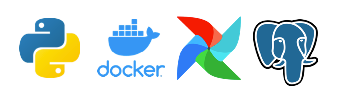

#### 5.2 План

- Установка
- Интерфейс
- Панель Администратора
- Напишем и запустим DAG


#### 5.3 Установка

Установить Airflow можно как минимум двумя способами:

1. Используя Docker и docker-compose
2. Руками, создавая виртуальное окружение Python и устанавливая туда все необходимые зависимости

Первый способ простой и не требует никаких усилий. Достаточно запустить команду `docker-compose up` и всё будет готово.
Файл `docker-compose.yml` можно найти [тут](../etl/docker-compose.yml)[^4].

#### 5.4 Интерфейс

Давайте знакомиться с пользовательским интерфейсом.
В адресной строке браузере введите `http://127.0.0.1:8080` и авторизуемся с логином `airflow` и таким же паролем (
прописаны в compose-файле)

#### 5.4.1 Основные компоненты интерфейса:

- **Pause/Unpause DAG** — слева находится переключатель для включения/выключения DAG. По умолчанию все новые DAG будут
  остановлены. Чтобы запустить DAG его необходимо предварительно включить.
- Колонка **Owner** обозначает владельца/автора DAG. Эта опция задаётся в коде в атрибутах DAG.
- **Runs** — показывает состояние запусков DAG. Есть 3 состояния:
    1. Успешно выполнен
    2. Выполняется
    3. Есть ошибки при выполнении
- **Schedule** — показывает с какой периодичностью будет запускаться DAG. Если видим значение None, то запуска по
  расписанию
  не будет, но мы можем запустить такой DAG вручную.
- **Last Run** — дата и время последнего запуска DAG
- **Recent Tasks** — отражает текущее состояние последних запусков DAG (последний запуск DAG и его операторов)
- **Actions** — кнопки манипуляции с DAG. Можно запустить DAG вручную, обновить или удалить DAG.
- **Links** — список для быстрого доступа к просмотру кода DAG, деталей выполнения, просмотру в виде графа или диаграммы
  Ганта, анализ времени выполнения задач и т.д.

#### 5.4.2 Просмотр DAG

Если кликнуть на любой DAG из списка, то мы увидим детальную информацию по нему:

- **Tree View** — просмотр DAG и зависимостей между операторами в виде дерева, также справа находится статус выполнения
  всех
  операторов, входящих в DAG с легендой. На статусы можно кликать, чтобы посмотреть более детальную информацию.
- **Graph View** — фактически то же самое, что и Tree View, но в виде графа.
- **Task Duration** — график времени выполнения DAG и операторов.
- **Task Tries** — график повторных запусков операторов по периодам. Также в Airflow есть механизм повторных запусков в
  случае неудач.
- **Landing Times** — график показывает время (в зависимости от периодичности, это могут быть дни, минуты и т.д. по оси
  Y)
  прошедшее относительно периода запуска и непосредственным запуском (DagRun) планировщиком. Представьте что есть DAG со
  `schedule_interval=@daily` запуск с `execution_date=2020-01-01` должен быть запланирован на `2020-01-02T00:00:00`, но
  планировщик из-за нагрузки запускает его в `2020-01-02T11:00:00`, тогда Landing Time для него будет 11 часов или 0.46
  дней.
- **Gantt** — отображает историю выполнения DAG в виде Диаграммы Ганта. Очень удобно, когда в DAG входит множество
  операторов, которые могут выполняться параллельно.
- **Details** — детальная информация по DAG, включая названия операторов, автора, начальное время старта DAG и т.д.
- **Code** — просмотр кода DAG.

#### 5.4.3 Панель Администратора

В админке видим следующие сущности:

- Variables
- Configurations
- Connections
- Plugins
- Providers
- Pools
- XComs

**Variables**

В этом разделе можно управлять переменными, которые будут храниться в базе данных Airflow. Удобно для хранения различной
информации, например, адреса хостов удалённых сервисов.
Нежелательно в этом разделе хранить данные доступов, т.к. переменные хранятся в открытом виде и могут быть
скомпрометированы третьими лицами. Но если очень хочется, то можно – в значении ключа нужно добавить постфикс
**_secret**, тогда значение будет отображаться скрытно.

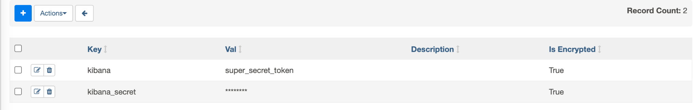

**Configurations**

Раздел позволяет редактировать настройки Airflow, используя графический интерфейс. По умолчанию опция отключена из
соображений безопасности.

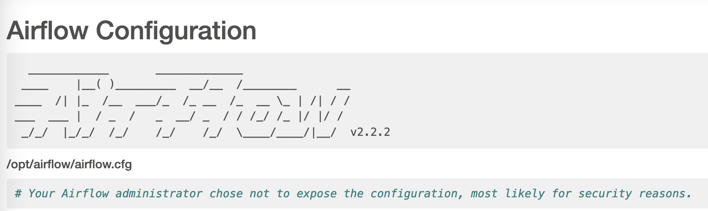

**Connections**

Раздел для хранения данных о доступе к различным сервисам: базам данных, облачным провайдерам, сторонним API сервисам и
т.д.
Не рекомендуется коде DAG`а хранить пароли и секретные ключи, а использовать для этого раздел Connections.
При использовании Connections в коде необходимо будет лишь передать значение **conn_id**.

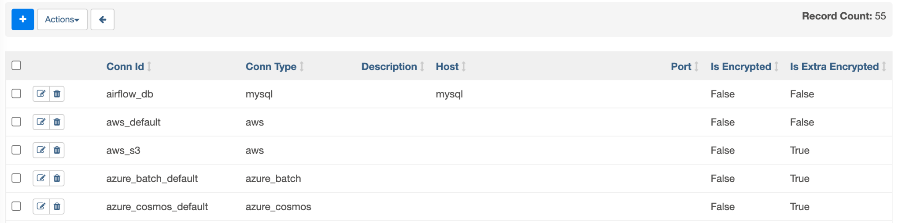

**Pools**

Возможность задать пул или другими словами некое ограничение на количество параллельно выполняющихся задач. Представим,
что мы хотим регулярно качать данные с внешнего сервиса. У сервиса есть ограничение на количество одновременных
соединений — 2. В этом случае мы создаём пул со значением 2 и присваиваем ему имя. Далее во всех операторах, отвечающих
за скачивание данных, передаём название этого пула.

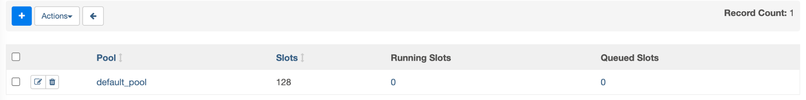

**XComs**

Это механизм обмена сообщениями между операторами. Т.к. задачи могут выполняться на разных компьютерах, то получить
возвращаемое значение одного оператора и передать другому привычным способом не получится (например, путём цепочек
вызовов или присвоением значения переменной).
Для таких ситуаций и создан XCom (cross-communication). Механизм работает через базу данных. По сути это аналог
key-value базы, один оператор записывает значение под определённым ключом, а другой оператор может получить это
значением, используя этот ключ. Не рекомендуется таким способом передавать большие сообщения, т.к. это требует
дополнительных накладных расходов.
В этом разделе можно увидеть все существующие сообщения, созданные операторами.

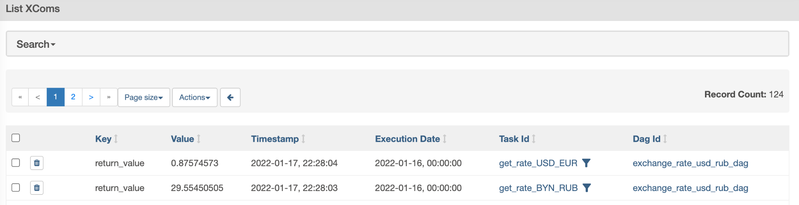

#### 5.4.4 Напишем и запустим DAG

У нас уже достаточно знаний об Airflow, чтобы попробовать создать свой первый DAG. Для начала создадим DAG лишь с одним
оператором, далее добавим ещё один и увидим как описывать зависимости. Таким образом у нас получится свой первый
небольшой пайплайн.
После этого попробуем забрать данные из внешнего API и записать их в БД.

Необходимо будет создать два объекта connections в интерфейсе:

Для таска `get_rate` мы напишем свой кастомный оператор, который будет тянуть данные из внешнего API. В качестве сервиса
будем использовать CurrencyScoop, у ребят есть бесплатный план по которому можно тянуть курсы валют. Ограничения
есть по количеству запросов в месяц и на некоторые методы API, но для нашего обучения это не критично.

Для работы с сервисом необходимо зарегистрироваться и получить API ключ. Ключ будет доступен сразу же после авторизации
на сайте:

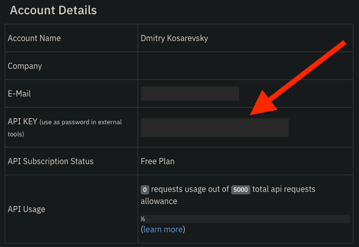

1. Для подключения к нашей БД
    1. Conn Id = `postgres_tink_seminar`
    2. Conn Type = `Postgres`
    3. Host = `host.docker.internal`
    4. Schema (В Airflow это поле указывает на БД, а не схему!) = `pg_db`
    5. Login = `postgres`
    6. Password = `postgres`
    7. Port = `5432`
2. Для подключения к внешнему API
    1. Conn Id = `cur_scoop`
    2. Conn Type = `HTTP`
    3. Password = ваш API ключ сервиса CurrencyScoop

### 6. Полезные ссылки

[Apache Airflow Documentation](https://airflow.apache.org/docs/apache-airflow/stable/)

[Docker Documentation](https://docs.docker.com/)

[Apache Airflow и конвейеры обработки данных](https://dmkpress.com/catalog/computer/data/978-5-97060-970-5/)

[Crontab.guru](https://crontab.guru/)


---

[^1]: [обзор ETL](https://ru.wikipedia.org/wiki/ETL)

[^2]: [Источник обзора решений](https://www.datarevenue.com/en-blog/airflow-vs-luigi-vs-argo-vs-mlflow-vs-kubeflow)

[^3]: [Apache Airflow](https://airflow.apache.org/)

[^4]: [docker-compose файл](https://airflow.apache.org/docs/apache-airflow/stable/docker-compose.yaml)
