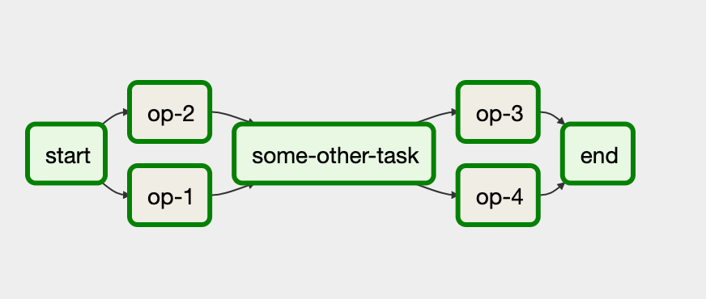
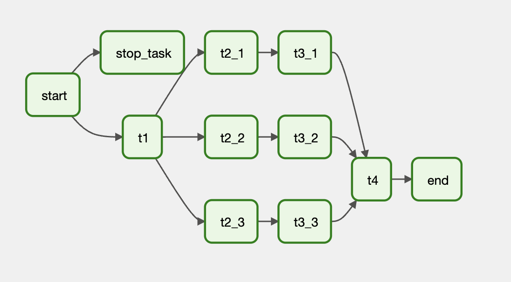

[Вернуться][main]

---

[Ссылка][hw] на ДЗ в Github Classroom.

# Домашнее задание:

### Цель задания - знакомство с Airflow.

#### Задание 0: Развернуть локально Airflow с использованием docker (1 балл)

#### Задание 1: Описать в коде DAG, который будет иметь связи графа как на изображении (1 балл)

#### Задание 2: Описать в коде DAG, который будет иметь связи графа как на изображении (1 балл)

#### Задание 3: Написать рабочий DAG с использованием как миниум трёх различных операторов из стандартного набора Airflow (2 балла)

#### Задание 4: Написать рабочий DAG с использованием кастомного оператора (2 балла)

#### Задание 5: Написать рабочий DAG, который будет ходить в любое внешнее API, собирать оттуда данные и сохранять в БД, это должна быть отдельная БД, а не БД с метаданными Airflow, для этого удобнее всего использовать ещё один контейнер (3 балла)

---

[Вернуться][main]

[main]: ../../README.md "содержание"

[hw]: https://classroom.github.com/a/... "ДЗ"
